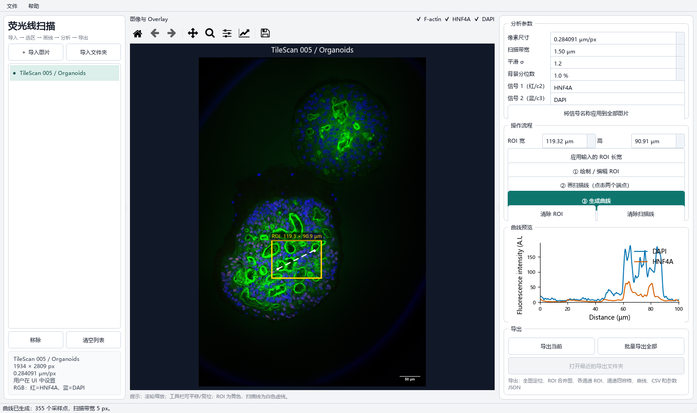

# Fluorescence Line-scan Analyzer

A desktop GUI for drawing and editing microscopy ROIs, extracting fluorescence line profiles from a user-defined number of channels, and exporting publication-ready ROI/channel panels.



## Features

- Import individual images or recursively load a folder.
- Open ZEISS CZI files directly: channel names, display colors, and pixel calibration load from the embedded metadata, and profiles use the raw (e.g. 16-bit) intensities.
- Automatically detect RGB, grayscale, multi-channel, and ZEISS-exported sibling TIFF channels.
- Add analysis channels manually, select their image source, and enter every signal name yourself.
- Choose a custom pseudocolor for each channel; the preview, curves, and exported channel images stay synchronized.
- Enter an exact ROI width and height to create an immediately draggable/resizable rectangle.
- Draw a line scan by selecting two endpoints inside the ROI.
- Zoom the image with the mouse wheel (cursor-centered), pan by dragging (left button when idle, middle button in ROI/line mode), and double-click to fit.
- Resize the application safely: side controls scroll instead of overlapping or collapsing.
- Configure pixel calibration, sampling-strip width, smoothing, and background subtraction.
- Optionally compute per-point SD across the sampling strip: curves gain a shaded mean ± SD band and the CSV gains `*_SD` columns.
- Preview all selected intensity profiles directly in the application.
- Export full-image QC overlays, cropped ROI images, one image per selected analysis channel, a dynamic channel panel, profile CSV, curves, and JSON metadata.
- Cell segmentation module (separate tab): classical Otsu + watershed (no extra dependencies) or Cellpose (optional, GPU-accelerated), whole image or ROI only, with boundary overlay preview and per-cell CSV / label-mask / overlay export.

## Channel workflow

The software does not assign biological names to channels. After importing an image, it lists objective sources such as `R/G/B`, `c1/c2/c3`, or `Channel 1...n`. Click **Add analysis channel** to open a compact setup dialog, then choose a source, type a signal name, and select a color. The main interface keeps only a one-line summary for each configured channel. Add as many unique source channels as the image provides.

## Installation

Python 3.10 or later is recommended.

```powershell
python -m venv .venv
.\.venv\Scripts\Activate.ps1
python -m pip install -r requirements.txt
```

## Run

On Windows, double-click `open_Fluorescence_Linescan_Analyzer.bat`, or run:

```powershell
python fluorescence_linescan_analyzer.py
```

Images can also be passed on the command line:

```powershell
python fluorescence_linescan_analyzer.py image1.tif image2.tif
```

## Workflow

1. Import one or more composite images.
2. Verify or enter the pixel size in `µm/px`.
3. Add the required analysis channels, select each source, and type every signal name.
4. Enter the ROI width and height, then create the draggable/resizable ROI.
5. Select two scan-line endpoints inside the ROI.
6. Generate the profiles and inspect the result.
7. Export the current result or batch-export all analyzed images.

## Exported files

Both export panels offer per-file checkboxes: only selected outputs are generated, and the selection persists across sessions. Each analyzed image can produce:

- `*_profile.csv`: distance and all selected signal intensity profiles, plus `*_SD` columns when the SD option is enabled.
- `*_overlay.png`: full-image ROI and line location.
- `*_ROI_composite.png`: clean cropped composite ROI.
- `*_ROI_composite_overlay.png`: cropped composite ROI with scan line.
- `*_ROI_<signal>.png`: one clean ROI image for every selected analysis channel.
- `*_ROI_channels_panel.png/.pdf`: a dynamically sized composite/channel panel with the scan line.
- `*_curve.png/.pdf`: line-profile curves.
- `*_analysis_panel.png`: cropped ROI and curve in one panel.
- `*_analysis.json`: calibration, ROI, line, signal, and processing metadata.

## Scientific note

Line profiles extracted from 8-bit pseudocolored exports are descriptive displayed intensities (A.U.). For rigorous between-sample fluorescence quantification, use original calibrated CZI or other raw 16-bit data and a validated segmentation/quantification workflow.

Chinese instructions are available in [README_GUI_中文.md](README_GUI_中文.md).
